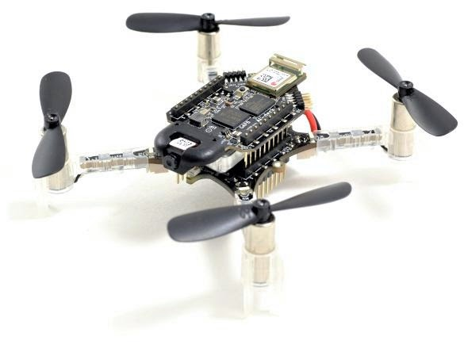

# PULP-Frontnet
AI-powered Human-Drone Pose Estimation Aboard Ultra-low Power Autonomous Flying Nano-UAVs.

<!--
[TODO: abstract, photo?]
-->

### Contributors
PULP-Frontnet is the product of collaboration by a team of amazing people spanning four academic institutions:
Nicky Zimmerman<sup>2</sup>,
Elia Cereda<sup>1</sup>,
Alessio Burrello<sup>3</sup>,
Francesco Conti<sup>3</sup>,
Hanna Müller<sup>4</sup>,
Alessandro Giusti<sup>1</sup>,
Jérôme Guzzi<sup>1</sup>,
and Daniele Palossi<sup>1,4</sup>.

<sup>1 </sup>Dalle Molle Institute for Artificial Intelligence (IDSIA), USI and SUPSI, Switzerland.<br>
<sup>2 </sup>Institute of Geodesy and Geoinformation (IGG) of University of Bonn, Germany.<br>
<sup>3 </sup>Department of Electrical, Electronic and Information Engineering (DEI) of University of Bologna, Italy.<br>
<sup>4 </sup>Integrated Systems Laboratory (IIS) of ETH Zürich, Switzerland.<br>

### Publications
If you use PULP-Frontnet in an academic context, we kindly ask you to cite the following publication:
* D. Palossi _et al._, ‘Fully Onboard AI-powered Human-Drone Pose Estimation on 
  Ultra-low Power Autonomous Flying Nano-UAVs’, _IEEE Internet of Things Journal_, 2021 —
  [arXiv preprint](http://arxiv.org/abs/2103.10873),
  [IEEE IoT Journal](https://ieeexplore.ieee.org/document/9462495).
  
```bibtex
@article{palossi2021,
	author = {Palossi, Daniele and Zimmerman, Nicky and Burrello, Alessio and Conti, Francesco and Müller, Hanna and Gambardella, Luca Maria and Benini, Luca and Giusti, Alessandro and Guzzi, Jérôme},
	title = {Fully Onboard {AI}-powered Human-Drone Pose Estimation on Ultra-low Power Autonomous Flying Nano-{UAVs}},
	journal = {{IEEE} Internet of Things Journal},
	issn = {2327-4662},
	doi = {10.1109/JIOT.2021.3091643},
	date = {2021},
	keywords = {Aerospace electronics, Aircraft, Computational modeling, Drones, Internet of Things, Robots, Task analysis},
}
```

### Acknowledgements
This work has been partially funded
by the Swiss National Science Foundation (SNSF) Spark (grant no. 190880),
by the Swiss National Centre of Competence in Research (NCCR) Robotics, 
and by the EU H2020 projects 1-SWARM and ALOHA (grant no. 871743 and 780788).

## Introduction
<a href="https://www.youtube.com/watch?v=_2iuprdUGXs">
  
  <br>
  YouTube video
</a>

<!--
[TODO: write introduction]
[TODO: introduce pose components]
-->

## Getting started

### Software requirements
* Ubuntu 20.04
* NVIDIA CUDA 11.1
* Python 3.7.10
* GAP SDK 3.9.1

### Hardware requirements


* Bitcraze [Crazyflie v2.1](https://store.bitcraze.io/collections/kits/products/crazyflie-2-1) quadrotor
* Bitcraze [AI-deck v1.1](https://store.bitcraze.io/collections/decks/products/ai-deck-1-1)
* Bitcraze [Flow-deck v2](https://store.bitcraze.io/collections/decks/products/flow-deck-v2)
* Olimex [ARM-USB-OCD-H](https://www.olimex.com/Products/ARM/JTAG/ARM-USB-OCD-H/) JTAG debugger +
  [ARM-JTAG-20-10](https://www.olimex.com/Products/ARM/JTAG/ARM-JTAG-20-10/) adapter board

### Source code and dependencies
The first step to setup PULP-Frontnet on your computer is to clone the source code,
initialize the submodules and install the required Python dependencies:
```shell
$ git clone https://github.com/idsia-robotics/pulp-frontnet.git
$ cd pulp-frontnet
$ git submodule update --init --recursive
$ pip install -r requirements.txt
```

### Datasets
Then, the datasets used for the experiments should be downloaded.
Due to their large size, the training and test datasets are not stored inside the Git repo. They
can be downloaded and extracted using the following commands:

```shell
$ cd PyTorch
$ curl https://drive.switch.ch/index.php/s/FMQOLsBlbLmZWxm/download -o pulp-frontnet-data.zip
$ unzip pulp-frontnet-data.zip
$ rm pulp-frontnet-data.zip
```

To ensure the files have been downloaded correctly, check their SHA256 checksums
against those stored in the repo:
```shell
$ sha256sum -c Data/checksums.txt
```

<!--
### Next steps
[TODO: describe how to perform the most common actions:
deploy precompiled GAP8 and STM32 binaries,
build GAP8 and STM32 code from source,
train and deploy a new model,
etc.]
-->

## PyTorch training and NEMO quantization
The process to produce a deployable PULP-Frontnet model is composed of several steps:
 * First, we train a _full-precision_ floating-point model using native
[PyTorch](https://pytorch.org) code.
 * In the second step, we use the [NEMO](https://github.com/pulp-platform/nemo)
open-source library to create a _fake-quantized_ copy of the network and fine tune it, so 
that the decline in regression performance due to quantization is minimized.
* After fine tuning, we use NEMO again to transform the network to _integer deployable_ form, in 
which all tensors (weights, inputs, outputs, and intermediate activation) are stored as integers 
and inference is entirely performed with integer arithmetic operations. 
  
Between each step, the model is evaluated against the test set, to ensure that 
regression performance doesn't drop due to a mistake.
More details about the quantization process can be found in the PULP-Frontnet
paper and in the [NEMO technical report](http://arxiv.org/abs/2004.05930).

### Supported model variants
One of the objectives of PULP-Frontnet is to explore the relationship between a model's 
regression performance and its memory and computational requirements. For this reason,
we compare three model architecture variants, which differ along two orthogonal 
dimensions: the size of input images fed to the network and the number of output channels
of the first convolutional layers.  

The desired variant can be selected by supplying one of these values to the `{variant}` parameter of the following scripts:
* `160x32`: 160×96 px input images, the first convolutional layer has 32 output channels (max. memory and computational requirements);
* `160x16`: 160×96 px input images, the first convolutional layer has 16 output channels (min. memory requirements);
* `80x32`: 80×48 px input images, the first convolutional layer has 32 output channels (min. computational requirements).

Already-trained model checkpoints for each variant are supplied in the `PyTorch/Models/`
sub-directory of this repo, named as follows:
* `Frontnet{variant}.pt`: full-precision model checkpoints;
* `Frontnet{variant}.Q.pt`: fake-quantized model checkpoints.

These checkpoints can be used to experiment with PULP-Frontnet without repeating 
the entire training process.

### Datasets
The datasets used in the experiments, consisting in a training set and a test set,
are stored in the `PyTorch/Data/` sub-directory of this repo.
For performance and reproducibility reasons, data augmentation and image downscaling has been 
performed offline as a pre-processing step.
The resulting datasets, ready to be used for training, have been publicly released.
For this reason, four files can be found in `PyTorch/Data/`:
* `160x96OthersTrainsetAug.pickle` and `160x96StrangersTestset.pickle` with 160×96 px input images, used for the `160x32` and `160x16` model variants;
* `80x48OthersTrainsetAug.pickle` and `80x48StrangersTestset.pickle` with 80×48 px input images, used for the `80x32` model variant.

The two pairs of datasets are identical except for the different image scale.

### Usage
Five scripts implement the training and quantization pipeline:
`FPTraining.py`, `FPTesting.py`, `QTraining.py`, `QTesting.py`, and `QExport.py`.
Their default configuration is to replicate the exact setup used in the paper.
Only one command-line parameter must always be supplied to specify the desired 
model variant to be trained.
Additional optional arguments are available to further customize the training 
process, as displayed by the `--help` command of each script. 

All five commands must be run from the `PyTorch/` subdirectory of this repo:
```shell
$ cd PyTorch
```

#### Full-precision training
Train a full-precision floating-point neural network using ordinary PyTorch code:
```shell
$ python Scripts/FPTraining.py {variant}
```
This will train the model for 100 epochs and save the model weights with lowest validation
loss to `Results/{variant}/Frontnet.pt`. 
Already-trained full-precision models can be found in `Models/Frontnet{variant}.pt`.

You can save the trained model to a custom location with the `--save-model PATH` flag.

#### Full-precision evaluation
Measure the regression performance of the full-precision model against the test set:
```shell
$ python Scripts/FPTesting.py {variant}
```

A different full-precision model can be evaluated by supplying the `--load-model PATH` flag. 
Evaluation is performed by computing three regression performance metrics for 
each component:
Mean Absolute Error (MAE),
Mean Squared Error (MSE),
and R2 Score.

#### [NEMO] Quantization-aware fine tuning
Create a fake-quantized copy of the network and fine tune it on the training set:
```shell
$ python Scripts/QTraining.py {variant}
```
Fake-quantized models are still floating-point, but they introduce _differentiable_
quantization operations on weights and intermediate activations. This results in
a model that performs similarly to a fully quantized one but is still trainable,
making it possible to fine-tune its weights so that the performance drop caused
by quantization is minimal.
Refer to Section 2 of the [NEMO technical report](http://arxiv.org/abs/2004.05930)
for details.

By default, `QTraining.py` will load the full-precision model `Results/{variant}/Frontnet.pt`,
convert it to fake-quantized form and fine tune it for 10 epochs. A different 
full-precision model can be loaded using the `--load-model PATH` flag.
The tuned model weights are then saved as `Results/{variant}/Frontnet.Q.pt`.
As before, the trained model can be saved to a custom location with `--save-model PATH`.
Already-trained fake-quantized models can be found in `Models/Frontnet{variant}.Q.pt`.

#### Quantized evaluation
Measure the regression performance of the fake-quantized model against the test set:
```shell
$ python Scripts/QTesting.py {variant}
```

A different fake-quantized model can be evaluated by supplying the `--load-model PATH` flag.

#### [NEMO] Quantized export
Transform the network to the integer-deployable form and export it to the format
expected by DORY:
```shell
$ python Scripts/QExport.py {variant}
```

Refer to Section 3 of the [NEMO technical report](http://arxiv.org/abs/2004.05930)
for details about this step.

By default, `QExport.py` will load the fake-quantized model `Results/{variant}/Frontnet.Q.pt`, 
a different fake-quantized model can be loaded by supplying the `--load-model PATH` flag.
The output files for the deployable model will be saved in `Results/{variant}/Export`,
ready to be used with DORY to generate the C code for inference on the GAP8 SoC.
In particular, NEMO exports an ONNX file with network architecture and weights
and a set of text files containing expected activation values on one example input image.

DORY computes checksums of the expected activations and uses them to perform a
runtime sanity check, ensuring that the activations produced by the generated code
match the expected ones.

## DORY Deployment

#### [DORY] Automatic C code generation
[coming soon]

#### Integrating the generated code
[coming soon]

#### Building the GAP8 application
[coming soon]

#### Building our custom Crazyflie firmware
[coming soon]
